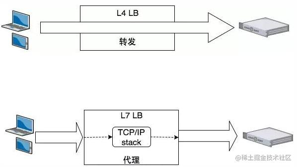

## Nginx负载均衡算法

### 负载均衡

#### 1. 负载均衡又分为四层负载均衡和七层负载均衡

四层负载均衡工作在OSI模型的*传输层*，主要工作是转发，它在接收到客户端的流量以后通过修改数据包的地址信息将流量转发到应用服务器。

七层负载均衡工作在OSI模型的*应用层*，因为它需要解析应用层流量，所以七层负载均衡在接到客户端的流量以后，还需要一个完整的TCP/IP协议栈。
七层负载均衡会与客户端建立一条完整的连接并将应用层的请求流量解析出来，再按照调度算法选择一个应用服务器，
并与应用服务器建立另外一条连接将请求发送过去，因此七层负载均衡的主要工作就是代理。

#### 2. 软硬件

1. 四层的负载均衡就是基于IP+端口的负载均衡

> 对应的负载均衡器称为四层交换机（L4 switch），主要分析IP层及TCP/UDP层，实现四层负载均衡。此种负载均衡器不理解应用协议（如HTTP/FTP/MySQL等等）

实现四层负载均衡的软件有：

- F5：硬件负载均衡器，功能很好，但是成本很高。
- lvs：重量级的四层负载软件
- nginx：轻量级的四层负载软件，带缓存功能，正则表达式较灵活
- haproxy：模拟四层转发，较灵活

2. 七层的负载均衡就是基于虚拟的URL或主机IP的负载均衡

> 对应的负载均衡器称为七层交换机（L7 switch），除了支持四层负载均衡以外，还有分析应用层的信息，如HTTP协议URI或Cookie信息，实现七层负载均衡。此种负载均衡器能理解应用协议

实现七层负载均衡的软件有:

- haproxy：天生负载均衡技能，全面支持七层代理，会话保持，标记，路径转移；
- nginx：只在http协议和mail协议上功能比较好，性能与haproxy差不多；
- apache：功能较差
- Mysql proxy：功能尚可。

总的来说，一般是lvs做4层负载；nginx做7层负载；haproxy比较灵活，4层和7层负载均衡都能做。

#### 3. 具体实现：
1. 目前负载均衡系统有Nginx、LVS、F5，即：

- Nginx是软件的7层负载均衡，
- LVS是内核的4层负载均衡，
- F5是硬件的4层负载均衡。

2. 软件和硬件的区别在于性能，硬件远远高于软件，即：

- Nginx的性能是万级的，一般的Linux服务器上安装一个Nginx能达到每秒5万并发请求；
- 而F5的性能能达到百万级，从200万每秒到800万每秒都有，不过价格很贵。

3. 4层和7层的区别在于协议和灵活性，即：

- Nginx是7层的，它支持HTTP等协议，
- 而LVS和F5是4层协议，它们和协议无关，几乎所有应用都可以做。

### 常见的几种负载均衡算法

1. 轮询法

将请求按顺序轮流地分配到后端服务器上，它均衡地对待后端的每一台服务器，而不关心服务器实际的连接数和当前的系统负载。

2. 加权轮询法

不同的后端服务器可能机器的配置和当前系统的负载并不相同，因此它们的抗压能力也不相同。给配置高、负载低的机器配置更高的权重，让其处理更多的请；而配置低、负载高的机器，给其分配较低的权重，降低其系统负载，加权轮询能很好地处理这一问题，并将请求顺序且按照权重分配到后端。

3. 随机法

通过系统的随机算法，根据后端服务器的列表大小值来随机选取其中的一台服务器进行访问。由概率统计理论可以得知，随着客户端调用服务端的次数增多，

其实际效果越来越接近于平均分配调用量到后端的每一台服务器，也就是轮询的结果。

4. 加权随机法

与加权轮询法一样，加权随机法也根据后端机器的配置，系统的负载分配不同的权重。不同的是，它是按照权重随机请求后端服务器，而非顺序。

5. 哈希算法

- 普通哈希：源地址哈希的思想是根据获取客户端的IP地址，通过哈希函数计算得到的一个数值，用该数值对服务器列表的大小进行取模运算，得到的结果便是客服端要访问服务器的序号。采用源地址哈希法进行负载均衡，同一IP地址的客户端，当后端服务器列表不变时，它每次都会映射到同一台后端服务器进行访问。
- 一致性Hash，相同参数的请求总是发到同一提供者。当某一台提供者挂时，原本发往该提供者的请求，基于虚拟节点，平摊到其它提供者，不会引起剧烈变动。一致性hash算法就是把每台server分成v个虚拟节点，再把所有虚拟节点（n*v）随机分配到一致性哈希的圆环上，这样所有的用户从自己圆环上的位置顺时针往下取到第一个vnode就是自己所属的节点。当此节点存在故障时，再顺时针取下一个作为替代节点

