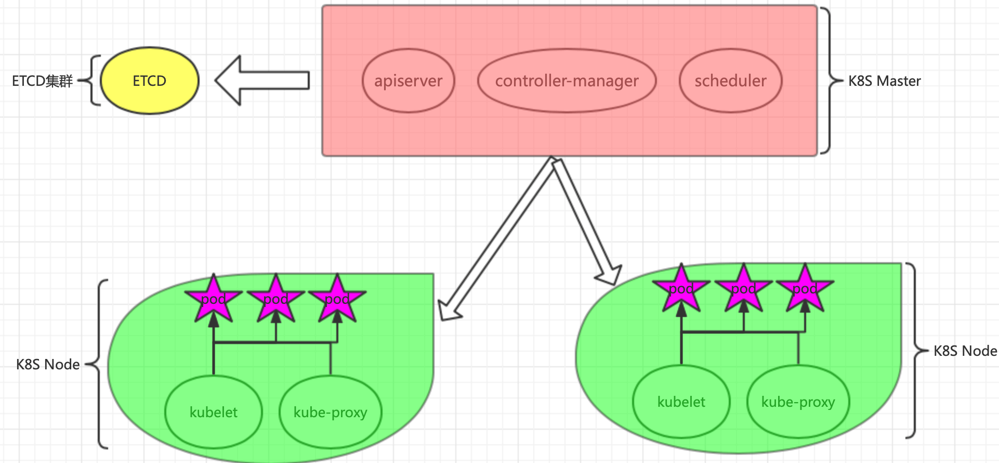

## k8s 集群提供的功能
- 调度与扩展，容器应该在哪里运行，根据 CPU 和 MEMORY 实现自动扩容
- 生命周期和健康状况，能自动替换失效的 POD，防止服务中断
- 服务发现，自动发生一组容器，并实现相互通信
- 监控，剔除故障节点，保证容器正常运行
- 认证，谁能访问我

`K8S 架构草图`

## Node 是什么？
`Node` 是 `Kubernetes` 的工作节点，以前叫做 `minion`。取决于你的集群，`Node` 可以是一个虚拟机或者物理机器。每个 `node` 都有用于运行 `pods` 的必要服务，并由 `master` 组件管理。`Node` 上的服务包括 `Docker`、网络组件 `(flannel)`、`kubelet` 和 `kube-proxy`。

## Node Conditions 字段描述
Node 条件 | 描述
---|---
Ready | True 节点运行状况良好并准备好接受Pod，False 如果节点运行状况不佳并且未接受Pod，Unknown 节点控制器最近一次未从节点收到消息 node-monitor-grace-period（默认值为40秒）
MemoryPressure | True 节点内存上存在压力，即节点内存不足；除此以外 False
PIDPressure | True 进程是否存在压力，即节点上的进程是否过多；除此以外 False
DiskPressure | True 磁盘大小是否受到压力，即磁盘容量是否不足；除此以外 False
NetworkUnavailable | True 节点的网络配置不正确，否则 False

## Node 故障，什么时候驱逐 Pod

是由 `Master` 组件 `kube-controller-manager` 两个参数控制：

- --pod-eviction-timeout：缺省为 5m，删除故障 node 上 Pod 的宽限期
- --node-monitor-grace-period：缺省为 40s，在标记 node 运行状况为不正常之前，允许运行的 node 停止响应的时间

## 保证服务可用一些方法

- 多 `Pod` 部署能提高服务性能，并且遇到极端情况也保证服务高可用
- 建议采用`节点互斥`的方式进行部署
- 对关键组件的监控，应该建立从进程到指标的多级监控，减小服务故障的时间
- Pod `存活检查` 和 `健康检查`，对容器内应用监控是非常必要的
- 云上 `K8S集群` Node节点应选择多个 `可用区`
- 集群Master组件 `kube-apiserver`、`kube-controller-manager`、`kube-scheduler` 一定要支持高可用
- `ETCD` 也要支持高可用
- 尽量程序操作，减少人为失误

## 参考链接

- https://kubernetes.io/docs/reference/command-line-tools-reference/kube-controller-manager/
- https://kubernetes.io/docs/concepts/architecture/nodes/
- https://blog.fleeto.us/post/node-downtime/
