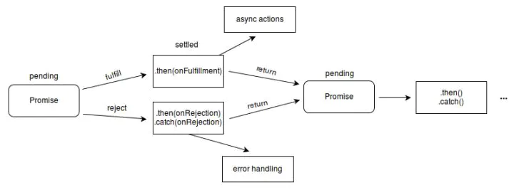
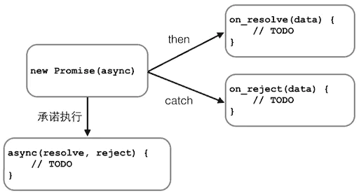

### 1. promise是什么？为什么会有promise?

首先，promise是js的抽象异步处理对象实现异步编程的方案，简单的说就是解决传统js运行单线程的诟病以及异步操作的多层级嵌套带来的麻烦。可以将异步数据变为同步；

* `Promise`对象的特点？

```javascript
对象的状态不受外界影响。
Promise对象代表一个异步操作，有三种状态：
pending（进行中）
fulfilled（已成功）
rejected（已失败）
只有异步操作的结果，可以决定当前是哪一种状态，任何其他操作都无法改变这个状态。

一旦状态改变，就不会再变，任何时候都可以得到这个结果。
Promise对象的状态变化只有如下2种：
pending->fulfilled
pending->rejected
只要这两种情况发生，状态就凝固，不会再变，会一直保持这个结果。

说明：如果改变已经发生了，你再对Promise对象添加回调函数，也会立即得到这个结果。这与事件（Event）完全不同，事件的特点是，如果你错过了它，再去监听，是得不到结果的。
```


* `Promise`的缺点？

```javascript
无法取消Promise，一旦新建它就会立即执行，无法中途取消。
如果不设置回调函数，Promise内部抛出的错误，不会反应到外部。
当处于pending状态时，无法得知目前进展到哪一个阶段（刚刚开始还是即将完成）
```
Promise最大的好处是在异步执行的流程中，把执行代码和处理结果的代码清晰地分离了：



`Promise`还可以做更多的事情，比如，有若干个异步任务，需要先做任务1，如果成功后再做任务2，任何任务失败则不再继续并执行错误处理函数。

要串行执行这样的异步任务，不用`Promise`需要写一层一层的嵌套代码。有了`Promise`，我们只需要简单地写：

```javascript
job1.then(job2).then(job3).catch(handleError);
```
* Promise的并行执行

除了串行执行若干异步任务外，`Promise`还可以并行执行异步任务。它依赖于前置的多个`Promise`对象，只有当这些`Promise`对象全部执行成功后，才会去执行`then`后面的回调函数。例如下面的`promise`对象`p1`和`p2`,这两个任务是可以并行执行的，用`Promise.all()`实现

```javascript
var p1 = new Promise(function (resolve, reject) {
  setTimeout(resolve, 500, 'P1');
});
var p2 = new Promise(function (resolve, reject) {
  setTimeout(resolve, 600, 'P2');
});
// 同时执行p1和p2，并在它们都完成后执行then:
Promise.all([p1, p2]).then(function (results) {
  console.log(results); // 获得一个Array: ['P1', 'P2']
});
```


有些时候，多个异步任务是为了容错。多个`Promise`对象只需要执行成功一个即可。只需要获得先返回的结果即可。例如下面例子，由于`p1`执行较快，`Promise`的`then()`将获得结果'`P1`'。`p2`仍在继续执行，但执行结果将被丢弃这种情况下，用`Promise.race()`实现。


```javascript
var p1 = new Promise(function (resolve, reject) {
  setTimeout(resolve, 500, 'P1');
});
var p2 = new Promise(function (resolve, reject) {
  setTimeout(resolve, 600, 'P2');
});
Promise.race([p1, p2]).then(function (result) {
  console.log(result); // 'P1'
});
```

